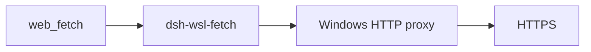

# dsh-wsl-fetch

> **Kit:** [dsh-wsl-kit](https://github.com/173787247/dsh-wsl-kit). Use `KIT_SET=daily` or `llm` (both install this plugin).

**Version / Works-with one-liner:** see **Compatibility** below (kept in sync with [dsh-wsl-kit](https://github.com/173787247/dsh-wsl-kit#compatibility-2026-09)).

DeepSeek Harness plugin: make official **`web_fetch`** use the Windows HTTP proxy from WSL.

[中文说明 → README.zh.md](./README.zh.md)

## Where it sits

Sends the official web_fetch through the Windows HTTP proxy. dsh-wsl-net only diagnoses; this plugin does the fetch.



Suite diagram and version snapshot: [dsh-wsl-kit](https://github.com/173787247/dsh-wsl-kit#how-the-pieces-fit). This plugin is **0.1.2** (daily; also in llm). Do not copy that matrix into this README.


## Compatibility

| Field | Value |
|-------|-------|
| **Plugin** | `dsh-wsl-fetch` **0.1.2** |
| **Minimum dsh** | ≥ **0.1.2** (web UI one-shot `?token=` on Windows relay `:3081`) |
| **Latest verified** | See [dsh-wsl-kit Compatibility](https://github.com/173787247/dsh-wsl-kit#compatibility-2026-09) (currently **`0.1.5-rc.1`**) — single source of truth for the suite |
| **Kit set** | `daily` (also in `github` / `full`; fetch+net also in `llm`) |
| **Cloud Flash** | Use model id **`deepseek-flash`** (V4.1 Flash) in `~/.dsh/settings.yaml` / `llm-deepseek` — not configured by this plugin |
| **Agent Teams** | Upstream experimental; not required here |

Suite floor versions: kit [`check-plugin-versions.sh`](https://github.com/173787247/dsh-wsl-kit/blob/master/scripts/check-plugin-versions.sh). Fault tree: [TROUBLESHOOTING.md](https://github.com/173787247/dsh-wsl-kit/blob/master/docs/TROUBLESHOOTING.md).

**Scope:** in-process official `web_fetch` via undici `ProxyAgent`. Requires `HTTP(S)_PROXY`. Cloudflare 403/1010 through Clash needs a **DIRECT** rule — outside this plugin.

## Why

Official `dsh-web-fetch-http` resolves DNS in WSL, then connects **directly** to that public IP with a custom undici `Agent`. That bypasses `NODE_USE_ENV_PROXY`. DeepSeek API can work (global `fetch` + proxy) while Mattermost/docs `web_fetch` fails with `TypeError: fetch failed`.

`dsh-wsl-net` only injects proxy env into **child** bash/npm. It cannot fix in-process `web_fetch`.

This plugin registers fetch provider `wsl-proxy` and, when `HTTPS_PROXY` / `HTTP_PROXY` is set, selects it so `web_fetch` uses undici `ProxyAgent`.

Private/localhost URLs stay blocked.

## Install

```sh
dsh plugin --profile web add github:173787247/dsh-wsl-fetch
```

Or via kit: `KIT_SET=daily bash install.sh` (includes this plugin).

Local checkout:

```sh
dsh plugin --profile web add /path/to/dsh-wsl-fetch
```

Restart with kit [`restart-dsh-web.sh`](https://github.com/173787247/dsh-wsl-kit/blob/master/scripts/restart-dsh-web.sh) (`NODE_USE_ENV_PROXY=1` + proxy env). Open a **new** session.

Awesome listing: [awesome-dsh-plugin entry](https://github.com/awesome-dsh-plugin/awesome-dsh-plugin/blob/main/data/plugins/173787247__dsh-wsl-fetch.yml) ([#4736](https://github.com/awesome-dsh-plugin/awesome-dsh-plugin/pull/4736) merged).

## Config

```yaml
- id: dsh-wsl-fetch
  name: dsh-wsl-fetch
  config:
    timeoutMs: 30000
    maxRedirects: 5
    retries: 2
    retryDelayMs: 400
```

| Key | Default | Meaning |
|-----|---------|---------|
| `timeoutMs` | `30000` | Fetch deadline |
| `maxRedirects` | `5` | Same-site redirects (`www` ↔ apex allowed) |
| `retries` | `2` | Extra attempts after transient proxy/network failure |
| `retryDelayMs` | `400` | Base delay between retries (× attempt) |
| `maxResponseBytes` | `5000000` | Body byte cap |
| `maxBodyChars` | `100000` | Decoded char cap |
| `userAgent` | product UA | Request User-Agent |

If `HTTP(S)_PROXY` is missing, the plugin stays registered but **unavailable**; official `http` remains selected.

## What success / failure look like

- Log: `[dsh-wsl-fetch] web_fetch via proxy (...:port) provider=wsl-proxy` → provider is active.
- Red fetch UI with that log line → **per-URL** proxy/TLS/site failure (retry another source). Not “plugin missing”.
- Cloudflare **403 / 1010** through Clash → site WAF; add Clash **DIRECT** for that host. This plugin cannot override WAF.

## Test

```sh
npm test
# live proxy path (same as dsh web_fetch)
bash scripts/stress.sh
```

## Changelog

See [CHANGELOG.md](./CHANGELOG.md).

## License

MIT
